# 🛡️ Deep-Voice Defender


> **"If you can't trust your ears, trust the code."**

**Deep-Voice Defender** is a Deep Learning project designed to detect AI-generated speech (Deepfakes) and distinguish it from real human voices. By converting audio into visual representations (**Mel-Spectrograms**), we train a **Convolutional Neural Network (CNN)** to spot the microscopic artifacts left behind by generative AI models like TTS and Voice Conversion algorithms.

---

## 🧠 How It Works ( The Pipeline )

We treat audio classification as an **Image Recognition** problem.

```mermaid
graph LR
    A[🎤 Raw Audio Input] -->|Librosa Load| B(Resampling @ 16kHz)
    B -->|Padding/Cutting| C(Fixed Length 4s)
    C -->|STFT + Log Scale| D[🖼️ Mel-Spectrogram]
    D -->|Input Features| E[🧠 CNN Model]
    E -->|Binary Output| F{🔴 Fake / 🟢 Real}
```



1.  **Preprocessing:** Raw audio is resampled to 16kHz and standardized to exactly 4 seconds (64,000 samples).
2.  **Feature Extraction:** We convert the waveform into a **Log-Mel-Spectrogram**, visualizing frequency intensity over time.
3.  **Detection:** A custom CNN analyzes the texture of the spectrogram to identify "glitches" invisible to the human ear.

---

## 📊 Dataset

We rely on the **ASVspoof 2019 (Logical Access)** dataset, the gold standard for anti-spoofing research.
* **Total Samples:** ~30,000+ Audio Files
* **Attacks Covered:** Text-To-Speech (TTS), Voice Conversion (VC)
* **Format:** FLAC / WAV

---

## 🛠️ Installation & Setup

Want to run this on your local machine? You'll need a GPU (NVIDIA RTX recommended).

<details>
<summary><b>Click to expand Installation Steps</b></summary>

### 1. Clone the Repository
```bash
git clone [https://github.com/YOUR_USERNAME/deep-voice-defender.git](https://github.com/YOUR_USERNAME/deep-voice-defender.git)
cd deep-voice-defender
```

### 2. Create the Virtual Environment
```bash
# Linux / WSL
python3 -m venv venv
source venv/bin/activate

# Windows (PowerShell)
python -m venv venv
.\venv\Scripts\activate
```

### 3. Install Dependencies
```bash
pip install -r requirements.txt
```

### 4. Setup Data
* Download the **ASVspoof 2019 LA** dataset.
* Extract it into `data/raw/LA/`.
* Your folder structure should look like this:
  ```
  data/
  └── raw/
      └── LA/
          ├── ASVspoof2019_LA_train/
          └── ...
  ```
</details>

---

## 🚀 Usage

### 1. Preprocessing
Convert the raw audio dataset into processed NumPy arrays for training.
```bash
python src/preprocessing.py
```

### 2. Training the Model
*(Coming Soon)*
```bash
python src/model.py
```

---

## 🗺️ Roadmap & Progress

- [x] **Project Setup:** GitHub Repo, WSL Environment, GPU Configuration.
- [x] **Data Pipeline:** Audio Loading, Resampling, Padding, Spectrogram Conversion.
- [ ] **Model Architecture:** Design CNN (Conv2D, MaxPool, Dropout layers).
- [ ] **Training:** Run training loop on RTX 4060/5060.
- [ ] **Evaluation:** Calculate EER (Equal Error Rate) and Accuracy.
- [ ] **Web Interface:** Build a simple Streamlit/Flask app for live demos.

---

## 👨‍💻 The Team

| Name | Role | GitHub |
| :--- | :--- | :--- |
| **Harshil** | Lead Developer / AI Engineer | [@Harshil](https://github.com/harshil-sri) |
| **Mrigank** | Developer / Data Engineer | [@Mrigank](https://github.com/mrigank-rana) |

---

<div align="center">
  <sub>Built with 💀 and ☕ by the Deep-Voice Defender Team.</sub>
</div>