# 🛡️ Deep-Voice Defender (WhatsApp-Ready)


> **"Deepfakes don't spread in studios. They spread on WhatsApp."**

**Deep-Voice Defender** is a robust Deep Learning system designed to detect AI-generated speech in **real-world scenarios**. Unlike standard academic models that fail on compressed audio, our architecture is specifically trained to handle the **OPUS codec compression** and **environmental noise** found in messaging apps like WhatsApp, Telegram, and Signal.

---

## 🎯 Our USP: "The Real-World Layer"

Most detectors achieve 99% accuracy on clean data but drop to 50% when a file is sent via WhatsApp. We solve this by introducing a **Dynamic Corruption Layer** during training:

1.  **OPUS Simulation:** We train on audio crushed to 16-32kbps bitrates to mimic messaging app compression.
2.  **Noise Injection:** We introduce Gaussian noise and environmental background sounds (traffic, fans) to force the model to learn invariant features.

---

## 🧠 How It Works (The Robust Pipeline)

```mermaid
graph LR
    A[🎤 Clean Audio] -->|Augmentation| B{🌪️ The 'Real-World' Mixer}
    B -->|Add Noise| C[🔊 Noisy Audio]
    B -->|Simulate OPUS| D[📉 Compressed Audio]
    C & D -->|STFT + Log Scale| E[🖼️ Mel-Spectrogram]
    E -->|Input Features| F[🧠 CNN Model]
    F -->|Binary Output| G{🔴 Fake / 🟢 Real}
```



---

## 📊 Dataset & Augmentation

We rely on the **ASVspoof 2019 (Logical Access)** dataset, hardened with our custom augmentation pipeline.

| Feature | Standard Models | **Deep-Voice Defender** |
| :--- | :---: | :---: |
| **Data Source** | Clean FLAC files | Compressed & Noisy Audio |
| **Bitrate** | Lossless (High Quality) | Variable (Low to High) |
| **Robustness** | ❌ Fails on WhatsApp | ✅ Works on WhatsApp |
| **Noise Handling** | ❌ Sensitive to Silence | ✅ Robust to Background Noise |

---

## 🛠️ Installation & Setup

<details>
<summary><b>Click to expand Installation Steps</b></summary>

### 1. Clone the Repository
```bash
git clone [https://github.com/YOUR_USERNAME/deep-voice-defender.git](https://github.com/YOUR_USERNAME/deep-voice-defender.git)
cd deep-voice-defender
```

### 2. Create the Virtual Environment
```bash
# Linux / WSL
python3 -m venv venv
source venv/bin/activate
```

### 3. Install Dependencies
```bash
pip install -r requirements.txt
```

### 4. Setup Data
Download the **ASVspoof 2019 LA** dataset and place it in `data/raw/LA/`.
</details>

---

## 🚀 Usage

### 1. Preprocessing
Standardizes the dataset length and sample rate.
```bash
python src/preprocessing.py
```

### 2. Training (With Augmentation)
Trains the CNN with the custom "WhatsApp-Simulation" layer active.
*(Coming Soon)*
```bash
python src/model.py
```

---

## 🗺️ Roadmap & Progress

- [x] **Project Setup:** GitHub Repo, WSL Environment, GPU Configuration.
- [x] **Data Pipeline:** Audio Loading, Resampling, Padding.
- [ ] **Augmentation Engine:** Build `augmentation.py` to simulate OPUS/Noise.
- [ ] **Model Architecture:** Design Robust CNN (Conv2D, MaxPool).
- [ ] **Training:** Run training loop on RTX 4060/5060.
- [ ] **Testing:** Test specifically on files sent via WhatsApp to verify USP.

---

## 👨‍💻 The Team

| Name | Role | GitHub |
| :--- | :--- | :--- |
| **Harshil** | Lead Developer / AI Engineer | [@Harshil](https://github.com/harshil-sri) |
| **Mrigank** | Developer / Data Engineer | [@Mrigank](https://github.com/mrigank-rana) |

---

<div align="center">
  <sub>Built with 💀 and ☕ by the Deep-Voice Defender Team.</sub>
</div>